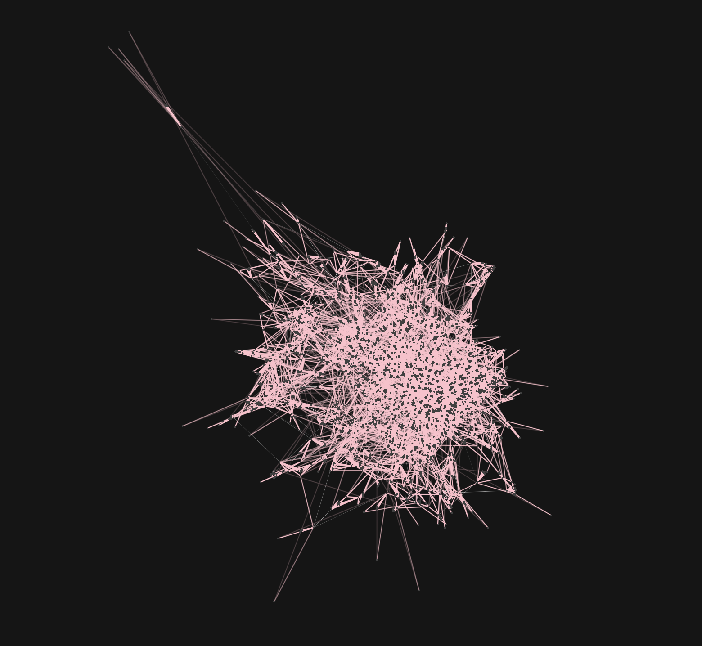

# TigerGraph Cosmos Template
Template for visualizing TigerGraph data with Cosmograph

## Quickstart

1. Clone repository and enter the directory of the clone repository

### Set Up the FastAPI Server
2. Create a virtual environment `python3 -m venv venv` and activate it `source venv/bin/activate/`
3. Install the libraries:
```
pip install pyTigerGraph fastapi uvicorn
```
4. Modify the connection parameters to your host, graph name, and password in [config.py](config.py)
5. Modify the VERTEX_TYPE and EDGE_TYPE in [config.py](config.py)
6. Run the server
```
uvicorn main:app --reload
```

### Run Cosmos
7. Install packages:
```
npm install
```
8. Build and run the code:
```
npx parcel build index.html
npx parcel index.html --open
```
9. View the graph at [http://localhost:1234](http://localhost:1234)!


## First Attempt Result:


